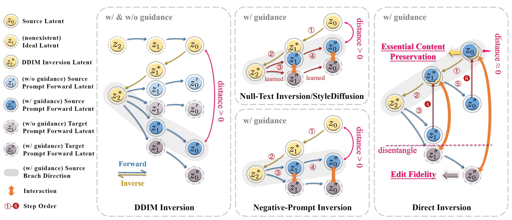
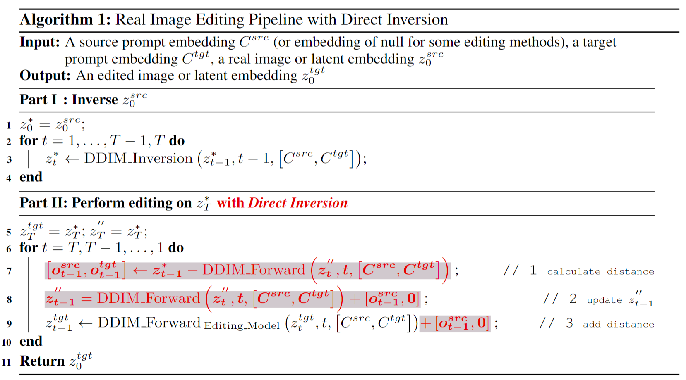
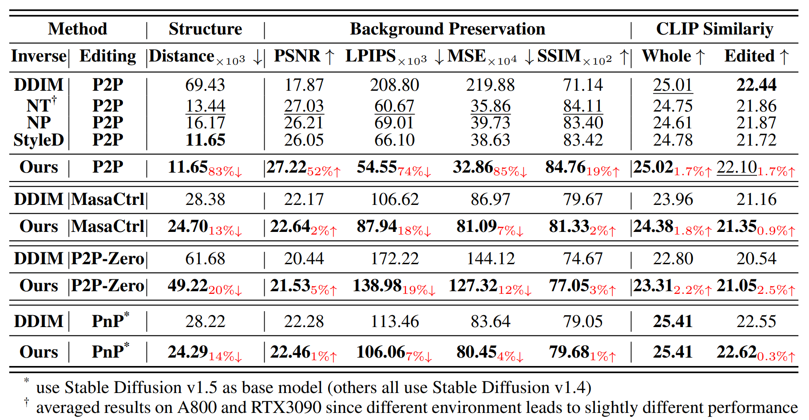
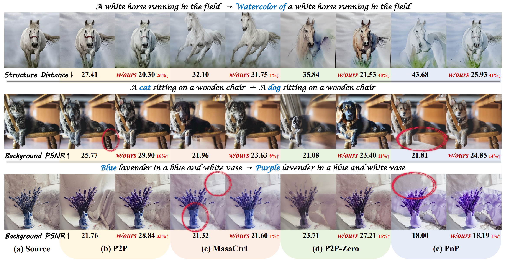

# PnPInversion


This repository contains the implementation of the ICLR2024 paper "PnP Inversion: Boosting Diffusion-based Editing with 3 Lines of Code" 

Keywords: Diffusion Model, Image Inversion, Image Editing

> [Xuan Ju](https://github.com/juxuan27)<sup>12</sup>, [Ailing Zeng](https://ailingzeng.site/)<sup>2*</sup>, [Yuxuan Bian](https://github.com/TreastBean)<sup>1</sup>, [Shaoteng Liu](https://www.shaotengliu.com/)<sup>1</sup>, [Qiang Xu](https://cure-lab.github.io/)<sup>1*</sup><br>
> <sup>1</sup>The Chinese University of Hong Kong <sup>2</sup>International Digital Economy Academy <sup>*</sup>Corresponding Author


<p align="center">
  <a href="https://cure-lab.github.io/PnPInversion/">Project Page</a> |
  <a href="https://arxiv.org/abs/2310.01506">Arxiv</a> |
  <a href="https://readpaper.com/paper/4807149696887816193">Readpaper</a> |
  <a href="https://forms.gle/hVMkTABb4uvZVjme9">Benchmark</a> |
  <a href="https://github.com/cure-lab/DirectInversion">Code</a> |
  <a href="https://drive.google.com/file/d/1HGr4ETPa7w-08KKOMhfxhngzQ9Y9Nj4H/view">Video</a> |
</p>


**📖 Table of Contents**

- [Method Overview](#method-overview)
- [Getting Started](#getting-started)
    - [Environment Requirement](#environment-requirement)
    - [Benchmark Download](#benchmark-download)
- [Running Scripts](#running-scripts)
    - [Inference](#inference)
    - [Evaluation](#evaluation)
- [Quantitative Results](#quantitative-results)
- [Qualitative Results](#qualitative-results)
- [Cite Us](#cite-us)
- [Acknowledgement](#acknowledgement)


## 🛠️ Method Overview
<span id="method-overview"></span>

Text-guided diffusion models revolutionize image generation and editing, offering exceptional realism and diversity. Specifically, in the context of diffusion-based editing, common practice begins with a source image and a target prompt for editing. It involves obtaining a noisy latent vector corresponding to the source image using the diffusion model, which is then supplied to separate source and target diffusion branches for editing. The accuracy of this inversion process significantly impacts the final editing outcome, influencing both *essential content preservation* of the source image and *edit fidelity* according to the target prompt. 

Previous inversion techniques attempted to find a unified solution in both the source and target diffusion branches. However, theoretical and empirical analysis shows that, in fact, a disentangling of the two branches leads to a clear separation of the responsibility for essential content preservation and edit fidelity, thus leading to better results in both aspects. In this paper, we introduce a novel technique called “**PnP Inversion**,” which rectifies inversion deviations directly within the source diffusion branch using just three lines of code, while leaving the target diffusion branch unaltered. To systematically evaluate image editing performance, we present **PIE-Bench**, an editing benchmark featuring 700 images with diverse scenes and editing types, complemented by versatile annotations. Our evaluation metrics, with a focus on editability and structure/background preservation, demonstrate the superior edit performance and inference speed of PnP Inversion across eight editing methods compared to five inversion techniques.





## 🚀 Getting Started
<span id="getting-started"></span>

### Environment Requirement 🌍
<span id="environment-requirement"></span>

This is important!!! Since different models have different python environmnet requirements (e.g. diffusers' version), we list the environmnet in the folder "environment", detailed as follows:

- p2p_requirements.txt: for models in `run_editing_p2p.py`, `run_editing_blended_latent_diffusion.py`, `run_editing_stylediffusion.py`, and `run_editing_edit_friendly_p2p.py`
- instructdiffusion_requirements.txt: for models in `run_editing_instructdiffusion.py` and `run_editing_instructpix2pix.py`
- masactrl_requirements.txt: for models in `run_editing_masactrl.py`
- pnp_requirements.txt: for models in `run_editing_pnp.py`
- pix2pix_zero_requirements.txt: for models in `run_editing_pix2pix_zero.py`
- edict_requirements.txt: for models in `run_editing_edict.py`

For example, if you want to use the models in `run_editing_p2p.py`, you need to install the environment as follows:

```shell
conda create -n p2p python=3.9 -y
conda activate p2p
conda install pytorch==1.12.1 torchvision==0.13.1 torchaudio==0.12.1 cudatoolkit=11.3 -c pytorch
pip install -r environment/p2p_requirements.txt
```

### Benchmark Download ⬇️
<span id="benchmark-download"></span>

You can download the benchmark PIE-Bench (Prompt-driven Image Editing Benchmark) [here](https://forms.gle/hVMkTABb4uvZVjme9). The data structure should be like:

```python
|-- data
    |-- annotation_images
        |-- 0_random_140
            |-- 000000000000.jpg
            |-- 000000000001.jpg
            |-- ...
        |-- 1_change_object_80
            |-- 1_artificial
                |-- 1_animal
                        |-- 111000000000.jpg
                        |-- 111000000001.jpg
                        |-- ...
                |-- 2_human
                |-- 3_indoor
                |-- 4_outdoor
            |-- 2_natural
                |-- ...
        |-- ...
    |-- mapping_file_ti2i_benchmark.json # the mapping file of TI2I benchmark, contains editing text
    |-- mapping_file.json # the mapping file of PIE-Bench, contains editing text, blended word, and mask annotation
```

**PIE-Bench Benchmark:**

<details> <summary>containing 700 images with 10 types of editing. Folder name in "annotation images" indicates the editing type. [Unfold for details] </summary>

| Folder Name | Editing Type | Explanation |
| :-----: | :----: | :----: |
| 0_random_140 | 0. random editing | random prompt written by volunteers or examples in previous research. 140 images in total. |
| 1_change_object_80 | 1. change object | change an object to another, e.g., dot to cat. 80 images in total. |
| 2_add_object_80 | 2. add object | add an object, e.g., add flowers. 80 images in total. |
| 3_delete_object_80 | 3. delete object | delete an object, e.g., delete the clouds in the image. 80 images in total.  |
| 4_change_attribute_content_40 | 4. change sth's content | change the content of sth, e.g., change a smiling man to an angry man by editing his facial expression. 40 images in total.  |
| 5_change_attribute_pose_40 | 5. change sth's pose | change the pose of sth, e.g., change a standing dog to a running dog. 40 images in total.  |
| 6_change_attribute_color_40 | 6. change sth's color | change the color of sth, e.g., change a red heart to a pink heart. 40 images in total.  |
| 7_change_attribute_material_40 | 7. change sth's material | change the material of sth, e.g., change a wooden table to a glass table. 40 images in total.  |
| 8_change_background_80 | 8. change image background | change the image background, e.g., change white background to grasses. 80 images in total.  |
| 9_change_style_80 | 9. change image style | change the image style, e.g., change a photo to watercolor. 80 images in total.  |


In editing type 1-9, we equally distribut the images to artifical images and natural images *(Noted that both these two categories are real images, artifical images are paintings or other human-generated images, real images are photos)*. In both two categories, images are equally distributed to animal, human, indoor scene and outdoor scene.


</details>


<details> <summary> The "mapping_file_ti2i_benchmark.json" contains annotation of editing text, blended word, and mask annotation for PIE-Bench. [Unfold for details] </summary>

The mapping_file_ti2i_benchmark.json contains a dict with following structure:

```python
{
    "000000000000": {
        "image_path": "0_random_140/000000000000.jpg", # image path
        "original_prompt": "a slanted mountain bicycle on the road in front of a building", # image prompt of the original image, [] shows the difference with editing_prompt
        "editing_prompt": "a slanted [rusty] mountain bicycle on the road in front of a building", # image prompt of the edited image, [] shows the difference with original_prompt
        "editing_instruction": "Make the frame of the bike rusty", # image editing instruction
        "editing_type_id": "0", # image editing type
        "blended_word": "bicycle bicycle", # the word to be edited
        "mask": [...] # mask with RLE encode, the part that needed to be edited is 1, otherwise 0.
        },
    ...
}
```

</details>

**TI2I Benchmark:**

We also add [TI2I benchmark](https://pnp-diffusion.github.io/) in the data for ease of use. TI2I benchmark contains 55 images and edited image prompt for each image.
The images are provided in data/annotation_images/ti2i_benchmark and the mapping file is provided in data/mapping_file_ti2i_benchmark.json.


## 🏃🏼 Running Scripts
<span id="running-scripts"></span>

### Inference 📜
<span id="inference"></span>

**Run the Benchmark**

You can run the whole image editing results through `run_editing_p2p.py`, `run_editing_edit_friendly_p2p.py`, `run_editing_masactrl.py`, `run_editing_pnp.py`, `run_editing_edict.py`, `run_editing_pix2pix_zero.py`, `run_editing_instructdiffusion.py`, `run_editing_blended_latent_diffusion.py`,`run_editing_stylediffusion.py`, and `run_editing_instructpix2pix.py`. These python file contains models as follows (please unfold):

<details> <summary> run_editing_p2p.py </summary>

| Inversion Method | Editing Method | Index | Explanation
| :-----: | :----: | :----: | :----: |
| DDIM | Prompt-to-Prompt |  ddim+p2p |  |
| Null-text Inversion | Prompt-to-Prompt | null-text-inversion+p2p |  |
| Negative-prompt Inversion | Prompt-to-Prompt | negative-prompt-inversion+p2p |  |
| DirectInversion(Ours) | Prompt-to-Prompt | directinversion+p2p |  |
| DirectInversion(Ours) (ablation: with various guidance scale) | Prompt-to-Prompt (ablation: with various guidance scale) | directinversion+p2p_guidance_{i}_{f} | For ablation study. {i} means inverse guidance scale, {f} means forward guidance scale. {i} could be chosen from \[0,1,25,5,75\]. {f} could be chosen from \[1,25,5,75\]. For example, directinversion+p2p_guidance_1_75 means inverse with gudiance scale 1.0, forward with 7.5. |
| Null-text Inversion | Proximal Guidance | null-text-inversion+proximal-guidance |  |
| Negative-prompt Inversion | Proximal Guidance | negative-prompt-inversion+proximal-guidance |  |
| Null-latent Inversion | Prompt-to-Prompt | ablation_null-latent-inversion+p2p | For ablation study. Edit the Null-text Inversion to Null-latent Inversion. |
| Null-Text Inversion  (ablation: single branch) | Prompt-to-Prompt | ablation_null-text-inversion_single_branch+p2p | For ablation study. Edit the Null-text Inversion to exchange null embedding only in source branch. |
| DirectInversion(Ours) (ablation: add with scale) | Prompt-to-Prompt (ablation: add with scale) | ablation_directinversion_{s}+p2p | For ablation study. {s} means the added scale. {s} could be chosen from \[04,08\]. For example, ablation_directinversion_02+p2p means add with scale=0.2. |
| DirectInversion(Ours) (ablation: skip step) | Prompt-to-Prompt (ablation: skip step) | ablation_directinversion_interval_{s}+p2p | For ablation study. {s} means the skip step. {s} could be chosen from \[2,5,10,24,49\]. For example, ablation_directinversion_interval_2+p2p means skip every 2 steps. |
| DirectInversion(Ours) (ablation: add source offset for target latent) | Prompt-to-Prompt (ablation: add source offset for target latent) | ablation_directinversion_add-source+p2p |  |
| DirectInversion(Ours) (ablation: add target offset for target latent) | Prompt-to-Prompt (ablation: add target offset for target latent) | ablation_directinversion_add-target+p2p |  |
</details>

<details> <summary> run_editing_stylediffusion.py </summary>

| Inversion Method | Editing Method | Index | Explanation
| :-----: | :----: | :----: | :----: |
| StyleDiffusion | Prompt-to-Prompt |  stylediffusion+p2p |  |
</details>

<details> <summary> run_editing_edit_friendly_p2p.py </summary>

| Inversion Method | Editing Method | Index | Explanation
| :-----: | :----: | :----: | :----: |
| Edit Friendly Inversion | Prompt-to-Prompt |  edit-friendly-inversion+p2p |  |
</details>


<details> <summary> run_editing_masactrl.py </summary>

| Inversion Method | Editing Method | Index | Explanation
| :-----: | :----: | :----: | :----: |
| DDIM | MasaCtrl |  ddim+masactrl |  |
| DirectInversion(Ours) | MasaCtrl |  directinversion+masactrl |  |
</details>


<details> <summary> run_editing_pnp.py </summary>

| Inversion Method | Editing Method | Index | Explanation
| :-----: | :----: | :----: | :----: |
| DDIM | Plug-and-Play |  ddim+pnp |  |
| DirectInversion(Ours) | Plug-and-Play |  directinversion+pnp |  |
</details>


<details> <summary> run_editing_pnp.py </summary>

| Inversion Method | Editing Method | Index | Explanation
| :-----: | :----: | :----: | :----: |
| DDIM | Pix2Pix-Zero |  ddim+pix2pix-zero |  |
| DirectInversion(Ours) | Pix2Pix-Zero |  directinversion+pix2pix-zero |  |
</details>


<details> <summary> run_editing_edict.py </summary>

| Inversion Method | Editing Method | Index | Explanation
| :-----: | :----: | :----: | :----: |
| EDICT | |  edict+direct_forward |  |

</details>


<details> <summary> run_editing_instructdiffusion.py </summary>

| Inversion Method | Editing Method | Index | Explanation
| :-----: | :----: | :----: | :----: |
|  | InstructDiffusion |  instruct-diffusion |  |

</details>


<details> <summary> run_editing_instructpix2pix.py </summary>

| Inversion Method | Editing Method | Index | Explanation
| :-----: | :----: | :----: | :----: |
|  | Instruct-Pix2Pix |  instruct-pix2pix |  |

</details>


<details> <summary> run_editing_blended_latent_diffusion.py </summary>

| Inversion Method | Editing Method | Index | Explanation
| :-----: | :----: | :----: | :----: |
|  | Blended Latent Diffusion |  blended-latent-diffusion |  |

</details>


For example, if you want to run DirectInversion(Ours) + Prompt-to-Prompt, you can find this method has an index `directinversion+p2p` in `run_editing_p2p.py`. Then, you can run the editing type 0 with DirectInversion(Ours) + Prompt-to-Prompt through:

```
python run_editing_p2p.py --output_path output --edit_category_list 0 --edit_method_list directinversion+p2p
```

You can also run multiple editing methods and multi editing type with:

```
python run_editing_p2p.py --edit_category_list 0 1 2 3 4 5 6 7 8 9 --edit_method_list directinversion+p2p null-text+p2p
```

You can also specify --rerun_exist_images to choose whether rerun exist images. You can also specify --data_path and --output for image path and output path. 


**Run Any Image**

You can process your own images and editing prompts to the same format as our given benchmark to run large number of images. You can also edit the given python file to your own image. We have given out the edited python file of `run_editing_p2p.py` as `run_editing_p2p_one_image.py`. You can run one image's editing through:

```shell
python -u run_editing_p2p_one_image.py --image_path scripts/example_cake.jpg --original_prompt "a round cake with orange frosting on a wooden plate" --editing_prompt "a square cake with orange frosting on a wooden plate" --blended_word "cake cake" --output_path "directinversion+p2p.jpg" "ddim+p2p.jpg" --edit_method_list "directinversion+p2p" "ddim+p2p"
```

We also provide jupyter notebook demo `run_editing_p2p_one_image.ipynb`.

Noted that we use default parameters in our code. However, it is not optimal for all images. You may ajust them based on your inputs.

### Evaluation 📐
<span id="evaluation"></span>

You can run evaluation through:

```
python evaluation/evaluate.py --metrics "structure_distance" "psnr_unedit_part" "lpips_unedit_part" "mse_unedit_part" "ssim_unedit_part" "clip_similarity_source_image" "clip_similarity_target_image" "clip_similarity_target_image_edit_part" --result_path evaluation_result.csv --edit_category_list 0 1 2 3 4 5 6 7 8 9 --tgt_methods 1_ddim+p2p 1_directinversion+p2p
```

You can find the choice of tgt_methods in `evaluation/evaluate.py` with the dict "all_tgt_image_folders". 

All the results of editing are avaible for download at [here](https://drive.google.com/drive/folders/1hy8QTiaOZllKmwn6-vwWmHOpRP3uX-Ji?usp=sharing). You can download them and put them with file structre as follows to reproduce all the results in our paper.

```
output
  |-- ddim+p2p
    |-- annotation_images
      |-- ...
  |-- directinversion+p2p
    |-- annotation_images
      |-- ...
...    
```


If you want to evaluate the whole table's results shown in our paper, you can run:


```
python evaluation/evaluate.py --metrics "structure_distance" "psnr_unedit_part" "lpips_unedit_part" "mse_unedit_part" "ssim_unedit_part" "clip_similarity_source_image" "clip_similarity_target_image" "clip_similarity_target_image_edit_part" --result_path evaluation_result.csv --edit_category_list 0 1 2 3 4 5 6 7 8 9 --tgt_methods 1 --evaluate_whole_table
```

Then, all results in the table 1 will be output in evaluation_result.csv.

## 🥇 Quantitative Results

<span id="quantitative-results"></span>

Compare PnP Inversion with other inversion techniques across various editing methods:



More results can be found in the main paper.

## 🌟 Qualitative Results

<span id="qualitative-results"></span>


Performance enhancement of incorporating PnP Inversion into four diffusion-based
editing methods:



Visulization results of different inversion and editing techniques:


More results can be found in the main paper.

## 🤝🏼 Cite Us


<span id="cite-us"></span>

```
@article{ju2023direct,
  title={PnP Inversion: Boosting Diffusion-based Editing with 3 Lines of Code},
  author={Ju, Xuan and Zeng, Ailing and Bian, Yuxuan and Liu, Shaoteng and Xu, Qiang},
  journal={International Conference on Learning Representations ({ICLR})},
  year={2024}
}
```


## 💖 Acknowledgement
<span id="acknowledgement"></span>

Our code is modified on the basis of [prompt-to-prompt](https://github.com/google/prompt-to-prompt), [StyleDiffusion](https://github.com/sen-mao/StyleDiffusion), [MasaCtrl](https://github.com/TencentARC/MasaCtrl), [pix2pix-zero](https://github.com/pix2pixzero/pix2pix-zero) , [Plug-and-Play](https://github.com/MichalGeyer/plug-and-play), [Edit Friendly DDPM Noise Space](https://github.com/inbarhub/DDPM_inversion), [Blended Latent Diffusion](https://github.com/omriav/blended-latent-diffusion), [Proximal Guidance](https://github.com/phymhan/prompt-to-prompt), [InstructPix2Pix](https://github.com/timothybrooks/instruct-pix2pix), thanks to all the contributors!

